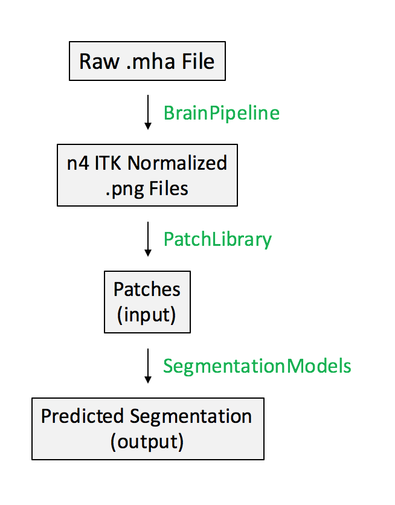

# Brain Segmentation Workflow
Below is the basic workflow for the code. [BrainPipeline](https://github.com/adarsh4146/brain_segmentation/blob/main/code/brain_pipeline.py), [PatchLibrary](https://github.com/adarsh4146/brain_segmentation/blob/main/code/patch_library.py) and [SegmentationModel](https://github.com/adarsh4146/brain_segmentation/blob/main/code/Segmentation_Models.py) are classes that handle each of these processes. [n4_bias_correction](https://github.com/adarsh4146/brain_segmentation/blob/main/code/n4_bias_correction.py) is a helper function that handles MRI bias and artifact corrections called by BrainPipeline.

  
